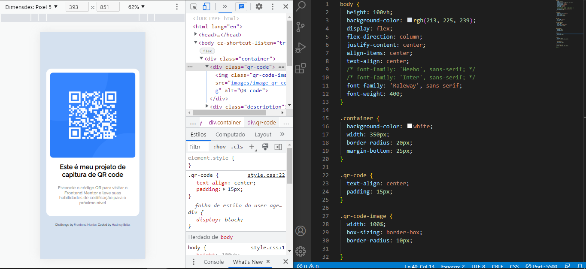
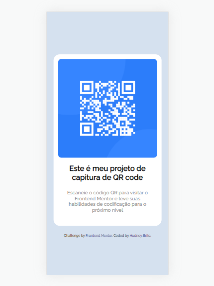

# Frontend Mentor - solução de componente de código QR

Esta é uma solução para o [desafio do componente de código QR no Frontend Mentor](https://www.frontendmentor.io/challenges/qr-code-component-iux_sIO_H).

## Índice

- [Visão geral](#visão-geral)
  - [Captura de tela](#captura-de-tela)
  - [Links](#links)
- [Meu processo](#meu-processo)
  - [Construído com](#construído-com)
  - [O que aprendi](#o-que-aprendi)
  - [Desenvolvimento contínuo](#desenvolvimento-contínuo)
- [Autor](#autor)
- [Agradecimentos](#agradecimentos)


## Visão-geral

### Captura de tela




### Links

- URL do site ao vivo: [Site ao vivo aqui](https://hudney-fsbrito.github.io/FrontEndMentor_ComponenteQRCode/)

## Meu processo

### Construído com

- Marcação HTML5 semântica
- Propriedades personalizadas CSS
- Flexbox [Flexbox](https://css-tricks.com/snippets/css/a-guide-to-flexbox/)
- Mobile First - Fluxo de trabalho móvel primeiro

### O que aprendi

Consegui assimilar o conceito de posicionamento de imagem e centralização de "div", que era algo que eu vinha com dificuldade.


```css
body {
  height: 100vh;
  display: flex;
  flex-direction: column;
  justify-content: center;
  align-items: center;
  text-align: center;
}

.qr-code-image {
  width: 100%;
  box-sizing: border-box;

}
```

### Desenvolvimento contínuo

Pretendo me especializar na estilização de páginas web e mobile principalmente na parte de animação e pseudo-elementos, ao mesmo tempo que aprendendo a utilização de ferramentas como uma linguagem de programação e suas bibliotecas e framworks, mais especificamente a linguagem JS.

## Autor

- Website - [Hudney-Brito-Portfolio](https://hudney-fsbrito.github.io/Hudney-Brito-Portfolio-/)
- LinkedIn - [Hudney Brito](https://www.linkedin.com/in/hudneyfernandes-dev/)

## Agradecimentos

Agradeço a toda a comunidade tech que disponibiliza todo um conteúdo na internet para quem quiser se aprofundar e aprimorar seus conhcimentos. 

